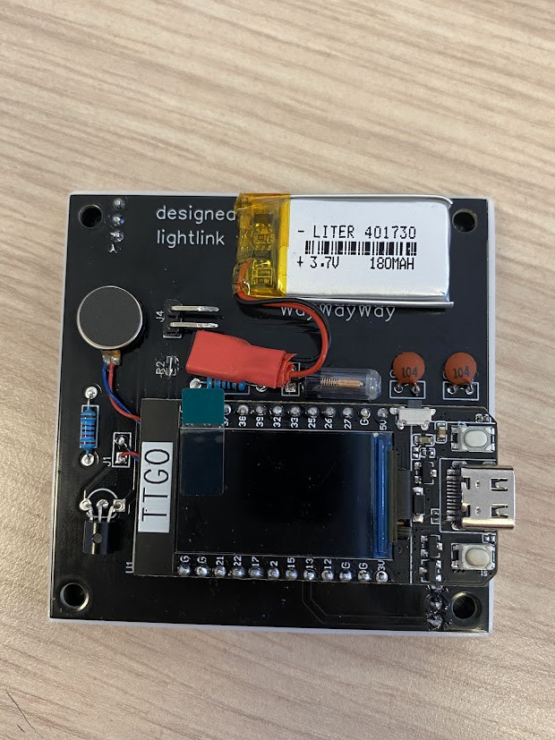

# Lightlink

  
   
  <i>The light link devices. </i>

 

Light Link is a device that allows you to create pixel art on your smartphone and display it on an LED matrix.
Using an easy-to-use website, you can draw, edit, and customize your designs. Once your masterpiece is ready,
send it wirelessly to Light Link and see your art in vibrant colors. Perfect for decorating your space, creating
unique displays, or sharing with friends, Light Link combines creativity and technology.

 

# The project

This project is an engineering school assignment completed during the second semester of 2024.
The main goal of this project was to connect people separated by distance, allowing them to draw small things on the device's screen using their phone.

 

# How the device work

The device is designed to work in pair with your phone. It connects to the internet to fetch drawings using your mobile data (shared hotspot). Once the device is connected to the internet, it will display the last drawing sent by your partner, and after 30 seconds, it goes to sleep to save some battery.
 
 
To send a drawing, all you need is your phone and an internet connection. Simply scan the QR code displayed on the device's backscreen and start drawing using the web app!

## Electronics

  
   
  <i>The schematic for the whole project. </i>

The device is using an ESP32 as microcontroller and a 8x8 LED matrix for the main display. At the back of the device, there 
is also an second screen to display some useful information like the battery level or the wifi strength. Light link is also 
equiped with a vibration motor to ensure that you don't miss any new drawings and also a vibration switch sensor
to wake the device up by tapping or shaking it. 
 
 
Every component is holded and connected together using a custom made PCB. Thanks to PCBWay that sponsored our project, we got 
those custom PCB for free! But before ordering them I made some prototype PCB board using a CNC machine. 

 

  
  
   
  <i>On the left, the prototype board made with my CNC and on the right the production PCB. </i>

## Web server

For the device, to be able to display drawings, we needed to create an API were you can fetch and send drawing to. This API is written in python and
is capable of receive new drawings from an HTTP POST request and send drawings with a simple HTTP call that will return the latest drawing in JSON format. 
The device call for that JSON data, decode it and then displays it to the main screen!

To be able to fetch drawings everywhere on earth, the API is hosted on a machine running ubuntu-server an opened to the world-wide-web. 

  
  
   
  <i>The web app used to send a drawing. </i>

# Manufacturing

The device is composed of two independant piece that need to be manufactured. 

## The plastic shell 

The plastic shell is 3D printed in PLA and is composed of 3 separate pieces, the case the light diffuser and the back cover. The case and back cover are holded together
using some small neodymium magnets to be able to open the device very quickly and easily and the diffuser is press fitted inside the case. 
 

  
  
   
  <i>The plastic case disassembled. </i>

## The board

As I said before, PCBs were sent by PCBWay, but before that we needed to engrave some PCBs using my CNC machine to see 
if everything works as intended before ordering production PCBs. The PCB, after the soldering of every component, is press
fitted inside the case. 

 

  
   
  <i>The process of engraving prototypes PCBs. </i>

## Result 

And here is the result!

 

  
  
   
  <i>The device completed. </i>

# Conclusion

Out of all electronics project that I made over the years, this one is the one that I'm the most proud of. I mastered lots of 
need skills like designing a PCB, using a CNC machine, engrave my own circuit board, creating a small API, make HTTP calls using
a microcontroller and much more. In addition to this, it is super rewarding to see the finished product working correctly ; And since this is a school project. And it is even more rewarding to get a nice grade out of it :).

# Licence
- romainflcht